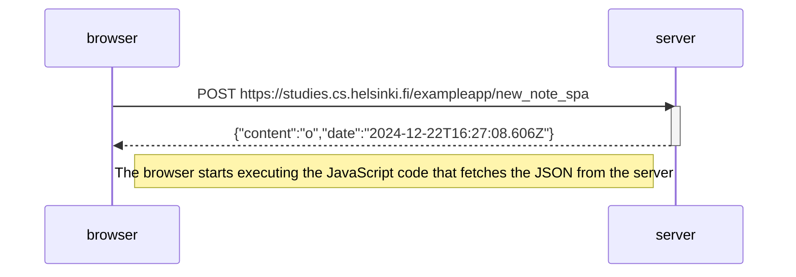

```mermaid
sequenceDiagram
    participant browser
    participant server

    browser->>server: POST https://studies.cs.helsinki.fi/exampleapp/new_note_spa
    activate server
    server-->>browser: {"content":"o","date":"2024-12-22T16:27:08.606Z"}
    deactivate server

    Note right of browser: The browser starts executing the JavaScript code that fetches the JSON from the server
```
